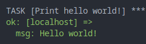

# VS Codeを使ってみる

- [事前準備 (ローカルホスト)](#事前準備-ローカルホスト)
- [事前準備 (Ansibleサーバ)](#事前準備-ansibleサーバ)
- [Remote SSHでansible1に接続する](#remote-sshでansible1に接続する)
- [Ansible拡張機能をインストールする](#ansible拡張機能をインストールする)
- [動作確認](#動作確認)

## 事前準備 (ローカルホスト)

お使いの端末にVS Codeをインストールします。  
[VS Code](https://code.visualstudio.com/)

Remote - SSH拡張機能をインストールします。  
[ms-vscode-remote.remote-ssh](https://marketplace.visualstudio.com/items?itemName=ms-vscode-remote.remote-ssh)

OpenSSHクライアント設定を入れておきます。  
今回は以下のような設定を入れました。

| 表示名 | SSHの通信先 | SSHログインユーザ名 |
| ----- | ---------- | ---------------- |
| ansible1 | 192.168.0.10 | endy |

- Linux, Macの場合: `~/.ssh/config`
- Windowsの場合: `%USERPROFILE%\.ssh\config`

```sh
Host ansible1
  HostName 192.168.0.10
  User endy
```

パスワード認証が面倒な場合には、SSH鍵ペアを作り、公開鍵を送付しておきましょう。

SSH鍵を作成します。

```sh
ssh-keygen
```

SSH公開鍵を送付します。

```sh
ssh-copy-id ansible1
```

## 事前準備 (Ansibleサーバ)

`tar`コマンドをインストールしておきます。  
Remote SSH拡張機能が裏で`tar`コマンドを使うためです。

```sh
sudo dnf install tar
```

## Remote SSHでansible1に接続する

VS Codeを起動し、`Ctrl+Shift+P`でコマンドパレットを呼び出します。  
(Macの方は`Command+Shift+P`)

`Connect to Host`と入力し、接続先として`ansible1`を選択します。  
必要に応じてSSH認証情報を入力します。

## Ansible拡張機能をインストールする

Remote SSHに接続したVS Code上で引き続き操作します。

`Ctrl+Shift+X`で拡張機能の画面を開きます。  
(Macの方は`Command+Shift+X`)

赤いアイコンのAnsible拡張機能をリモート側に (ansible1に) インストールします。  
([redhat.ansible](https://marketplace.visualstudio.com/items?itemName=redhat.ansible))

Ansible拡張機能の使い方について、詳細に知りたい方は以下の資料も参考にしてください。  
[AnsibleユーザーのためのVS Code拡張機能の紹介](https://speakerdeck.com/stopendy/vs-code-ansible-extension-for-dummies)

## 動作確認

[../2_hello_world](../2_hello_world)を実行してみましょう。

まず、VS Code上で本リポジトリのフォルダを開きます。

`File > Open Folder (Ctrl+K Ctrl+O)` を選択し、本リポジトリのディレクトリを開いてください。
(Macの方は`Command+K Command+O`)

統合ターミナルを開きます。  
Terminal > New Terminal (Ctrl+Shift+`)

以下のコマンドを実行してください。

```sh
cd 2_hello_world
ansible-playbook playbook.yml
```

以下のような実行結果を得られれば成功です。



以降のデモはVS Codeで実施します。
