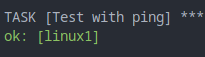

# Linuxの初期設定を自動化する

- [まずは疎通確認から](#まずは疎通確認から)
- [Apache httpdのインストール](#apache-httpdのインストール)
- [firewalldの通信許可設定追加](#firewalldの通信許可設定追加)
- [IPアドレスの設定](#ipアドレスの設定)

## まずは疎通確認から

自動化の前に、まずはAnsibleからLinuxに接続してみましょう。  
接続確認には[ansible.builtin.ping](https://docs.ansible.com/ansible/latest/collections/ansible/builtin/ping_module.html)モジュールを使用します。

まずはプレイブックを実行してみます。

```sh
ansible-playbook -i hosts 4_set_up_linux/playbook_1_ping.yml
```

以下の画像のように`ok`と表示されたら成功です。



今回使ったファイルは以下のとおりです。  
補足ですが、hostsにFQDNやIPアドレスを直接記入した場合は[../host_vars/linux1.yml](../host_vars/linux1.yml)の`ansible_host`指定は不要です。  
以降の演習でも同じインベントリファイルと変数ファイルを使用します。

| ファイル | 説明 |
| ------- | --- |
| [playbook_1_ping.yml](playbook_1_ping.yml) | プレイブック |
| [../hosts](../hosts) | インベントリ |
| [../group_vars/linux.yml](../group_vars/linux.yml) | グループ変数。今回は認証情報を格納 |
| [../host_vars/linux1.yml](../host_vars/linux1.yml) | ホスト変数。今回は接続先IPアドレス情報を格納 |

## Apache httpdのインストール

先ほどのプレイブック実行により、`linux1`に対して問題なくAnsibleを実行できることがわかりました。  
後は適切なモジュールを使ってプレイブックを書けば、どんどん自動化できます。

では手始めにApache httpdをインストールしてみましょう。  
インストールするだけではhttpdを使えないので、起動までさせちゃいます。

今回は以下2つのモジュールを使用します。

- [ansible.builtin.dnf](https://docs.ansible.com/ansible/latest/collections/ansible/builtin/dnf_module.html)
- [ansible.builtin.systemd_service](https://docs.ansible.com/ansible/latest/collections/ansible/builtin/systemd_service_module.html)

(任意)  
実行する前に`linux1`の状態を確認しておきましょう。  
実行する前は`httpd`がインストールされていないはずです。

```sh
rpm -q httpd
systemctl status httpd.service
```

では、以下のコマンドでプレイブックを実行しましょう。  
([playbook_2_set_up_httpd.yml](playbook_2_set_up_httpd.yml))

```sh
ansible-playbook -i hosts 4_set_up_linux/playbook_2_set_up_httpd.yml
```

以下のような実行結果を得られていれば成功です。  
設定変更された場合には`changed`と表示されます。


(任意)  
プレイブック実行後、確認コマンドをもう一度実行して状態が変わったことを確認してください。

## firewalldの通信許可設定追加

firewalldのデフォルト設定ではlocalhostからしかTCP 80に通信できません。  
`linux2`から`linux1`にhttp通信できるように、firewalldに許可設定を追加しましょう。  
今回は[ansible.posix.firewalld](https://docs.ansible.com/ansible/latest/collections/ansible/posix/firewalld_module.html)を使ってfirewalldの設定を変更します。

(任意)  
プレイブックを実行する前に`linux1`の状態を確認しておきましょう。  
実行する前は`default`ゾーンの`port`に`80/tcp`の記載がないはずです。

```sh
sudo firewall-cmd --list-all
```

Ansibleを使って確認するなら、以下のコマンドを実行しても良いでしょう。  
`ansible`コマンドは、プレイブック相当の情報をすべてコマンドラインオプションで指定できます。
詳しく知りたい方は`ansible --help`コマンドの実行結果や、公式ドキュメントの[Introduction to ad hoc commands](https://docs.ansible.com/ansible/latest/command_guide/intro_adhoc.html)を参照してください。

```sh
ansible -a 'firewall-cmd --list-all' -i hosts -v linux1
ansible -m ansible.posix.firewalld_info -i hosts -v linux1
```

では、以下のコマンドでプレイブックを実行しましょう。  
([playbook_3_permit_httpd_at_firewalld.yml](playbook_3_permit_httpd_at_firewalld.yml))

```sh
ansible-playbook -i hosts 4_set_up_linux/playbook_3_permit_httpd_at_firewalld.yml
```

以下のような実行結果を得られていれば成功です。  
firewalldのタスクは設定変更されたので`changed`と表示されます。  
一方で先ほどのhttpdのタスクについては、`linux1`がプレイブックの記載どおりになっているので`ok`と表示されます。


## IPアドレスの設定

自動化対象のLinuxはCentOS Stream 9です。  
このLinuxディストリビューションは、NetworkManagerでネットワーク設定を行うのが標準の手順となっています。

そこで、今回は[community.general.nmcli](https://docs.ansible.com/ansible/latest/collections/community/general/nmcli_module.html)モジュールを使ってIPアドレス設定を行います。

事前に以下のようなコマンドでインターフェース名を確認しておきます。

```sh
nmcli device
nmcli
ip -br address show
```

今回は、`ens4`に`1.1.1.2/24`というIPアドレスをアサインします。  
また、後続のデモのため`1.1.1.1`をデフォルトゲートウェイとして指定しておきます。


では、プレイブックを実行しましょう。  
([playbook_4_nmcli.yml](playbook_4_nmcli.yml))

```sh
ansible-playbook -i hosts 4_set_up_linux/playbook_4_nmcli.yml
```

以上で`linux1`のセットアップ自動化は完了です。  
お疲れ様でした。
